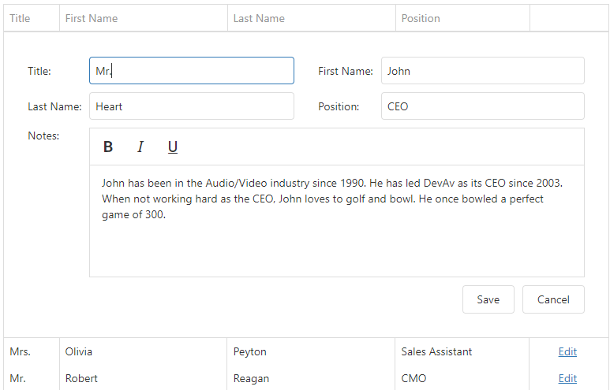

<!-- default badges list -->

<!-- default badges end -->
# DevExtreme DataGrid - How to display HtmlEditor in the 'form' editing mode

This example illustrates how to display HtmlEditor in the 'form' editing mode of DataGrid. 
For this, we define it using the [columns[].formItem](https://js.devexpress.com/Documentation/ApiReference/UI_Widgets/dxDataGrid/Configuration/columns/#formItem) option and set HtmlEditor's options in the [formItem.editorOptions](https://js.devexpress.com/Documentation/ApiReference/UI_Widgets/dxForm/Item_Types/SimpleItem/#editorOptions) configuration object.

HtmlEditor is built on top of and requires the [DevExtreme Quill](https://github.com/DevExpress/devextreme-quill/).

## Files to Review

- **jQuery**
    - [index.html](jquery/index.html)
- **Angular**
    - [app.component.html](angular/src/app/app.component.html)
    - [app.component.ts](angular/src/app/app.component.ts)
- **AngularJS**
    - [index.html](jquery/index.html)
- **Vue**
    - [App.vue](vue/src/App.vue)
- **React**
    - [App.js](react/src/App.js)
- **ASP.Net Core**    
    - [Index.cshtml](ASP.NET%20Core/DataGridCustomSorting/Views/Home/Index.cshtml)
    
## Documentation

- [Getting Started with DataGrid](https://js.devexpress.com/Documentation/Guide/UI_Components/Scheduler/Getting_Started_with_DataGrid/)

- [DataGrid - API Reference](https://js.devexpress.com/Documentation/ApiReference/UI_Components/dxDataGrid/)
